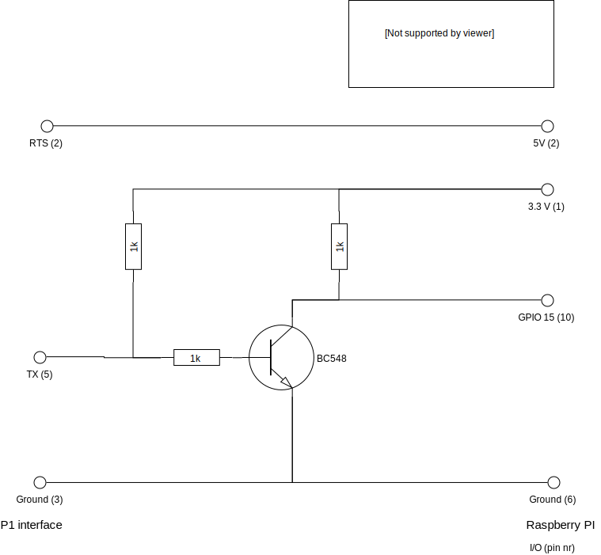
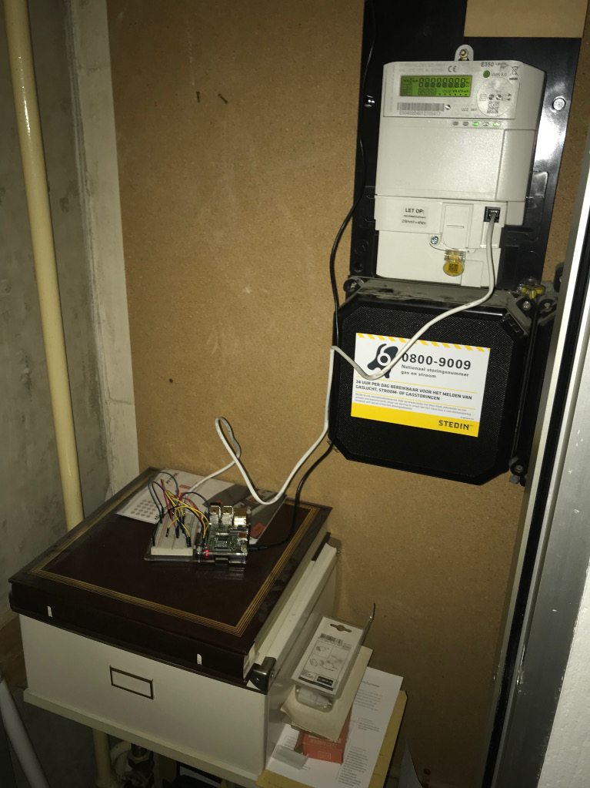
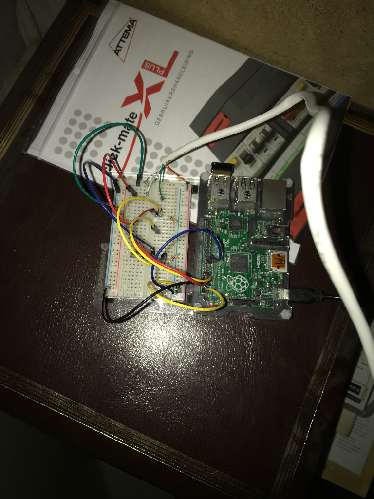
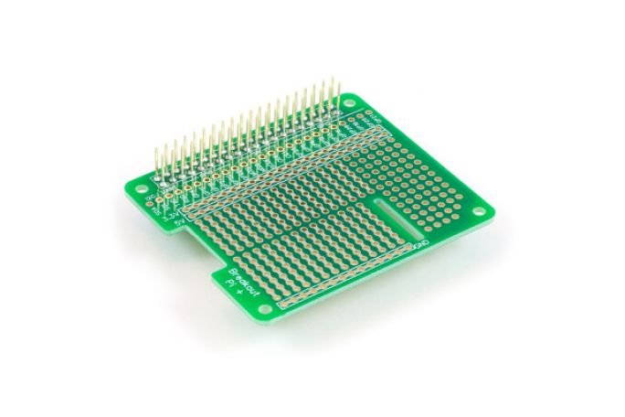
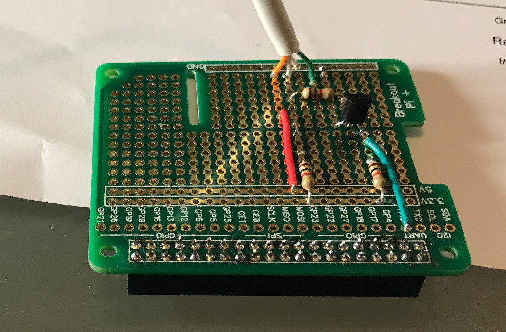
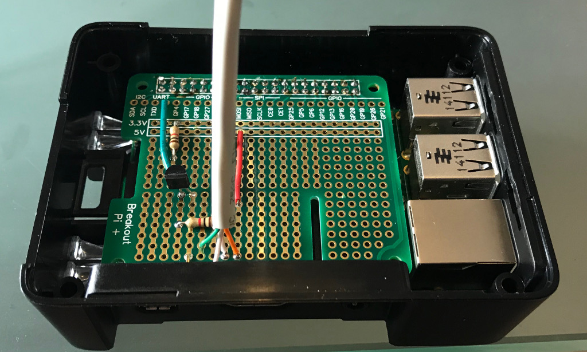
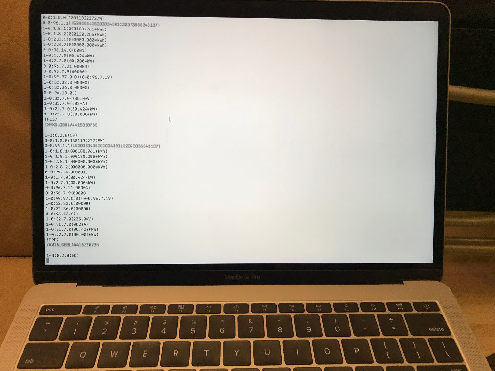
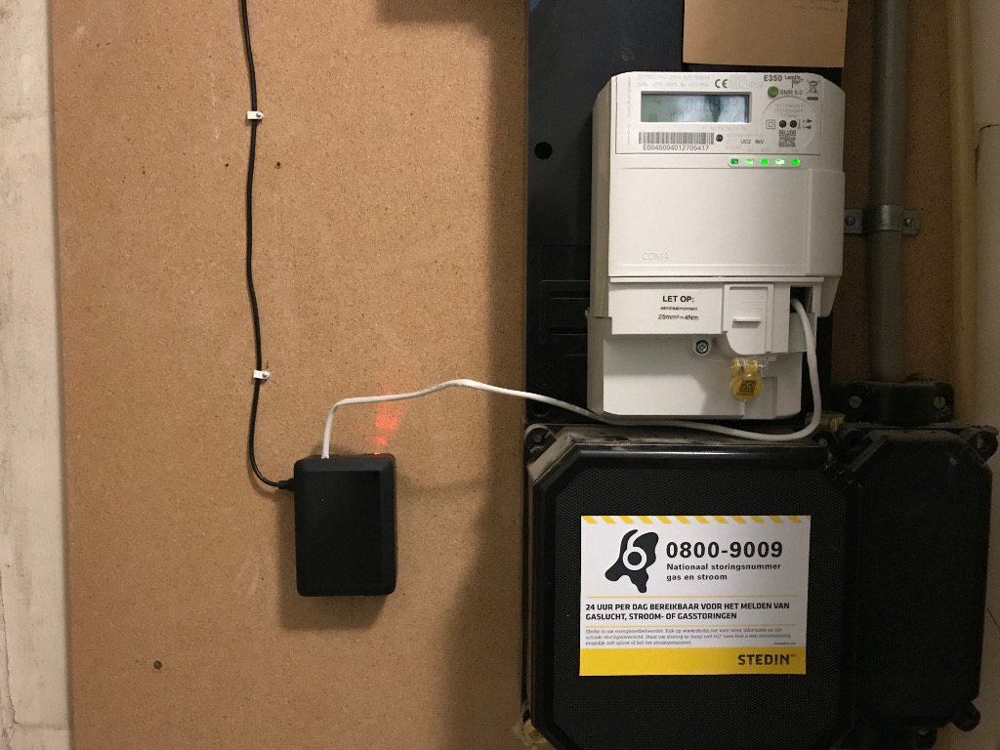

# Uitlezen Nederlandse 'Slimme' meter P1 poort over netwerk

## Wat wordt hier beschreven

De nieuwe Nederlandse Slimme meters moeten voorzien worden van een zgn P1 poort. Deze poort die toegankelijk is voor de eindgebruiker geeft informatie over het energieverbruik. Deze bestaat uit informatie over het elektriciteitsverbruik en het gasverbruik (als de meter verbonden is met een slimme gasmeter).

De P1 poort kan verbonden worden met commercieel verkrijgbare hardware om de gegevens van de meter te verwerken. De vrij verkrijgbare software [Domoticz](https://domoticz.com/) kan ook worden gekoppeld. Dit kan rechtstreeks via de serieele port van de server waarop Domoticz draait. Er zijn ook situaties denkbaar waar de Domoticz server ergens ver van de meterkast draait.

Dit artikel beschrijft hoe je met een Raspberry Pi en wat eenvoudige elektronische componenten een service maakt waarmee de P1 gegevens via een netwerk TCP socket op afstand uit te lezen zijn.

## Verbinden P1 met Raspberry Pi seriele poort

Ik beschrijf hier de verbinding tussen de seriele poort van de Raspberry Pi zelf. Het is dus niet nodig om een usb naar serieel converter aan te schaffen.

* voordeel: goedkoper, simpeler
* nadeel: sommige usb-serieel converters ondersteunen signaal inversie. De ingebouwde seriele poort van de Raspberry Pi niet.

Hieronder de verbinding tussen de Raspberry Pi en verschillende typen slimme meters. Voorlopig begin ik met de Landys en Gyr E350, omdat ik die bij mij thuis geinstalleerd is.

### Landys en Gyr E350 ZCF-110

De P1 poort op deze meter geeft de data af op een 'open collector' uitgang. Deze moet met een zgn. 'pull-up' weerstand aan de voedingsspanning gehangen worden. De uitgang zal dan bij een logische 1 aan de aarde verbonden worden door de meter.

De aansluitingen van de P1 poort zijn als volgt

| Pin nr | Functie |
| ------ | ------- |
|  2     | RTS     |
|  5     | Data transmit |
|  3     | Massa (ground) |

De via de pull-up weerstand verbonden uitgang geeft nu een signaal af dat bij logisch 0 de voedingsspanning heeft en bij logisch 1 0 volt. Dit is een geinverteerd signaal. Als je dit aansluit aan de seriele poort van de Raspberry Pi zul je wel informatie zien binnenkomen. Maar deze informatie is corrupt. Je ziet ook als is de poortinstelling correct kwa baudrate, parity en stop bits alleen maar rommel binnenkomen, geen leesbare informatie.

Het is dus zaak om het signaal te inverteren. Gelukkig is dit niet heel ingewikkeld. Met een simpel circuit bestaande uit een transistor en 2 weerstanden kan dit gedaan worden. De componenten kosten nog geen euro.



Hier zie je hoe het er als prototype uitziet op een breadboard.






Ik heb de [Breakout Pi Plus](https://www.kiwi-electronics.nl/breakout-pi-plus?search=Breakout%20Pi%20Plus) besteld  Hier kan ik het circuit op een nette compacte manier opbouwen voor gebruik 'in productie'.

## Raspberry Pi seriele poorten

### Raspberry Pi 1, 1+ en 2

De Raspberry Pi (type 1, 1+, 2)heeft een seriele poort. Device */dev/ttyAMA0*. Deze is verbonden met pinnen op de GPIO connector.

### Raspberry Pi 3 en Zero W

De Raspberry Pi type 3 en Zero W heeft er 2. */dev/ttyAMA0* wordt intern gebruikt voor de bleutooth zender. De 2e seriele poort is verbonden met de GPIO pinnen. Deze heeft device */dev/ttyS0*. Deze poort is zeer beperkt. Heeft een klok die afhankelijk is van de VPU clock. Het is echter mogelijk om deze port toe te wijzen voor verbinding met de bluetooth zender en de volwaardige device */dev/ttyAMA0* weer toe te kennen aan de GPIO pinnen. Zie hiervoor:

[THE RASPBERRY PI UARTS](https://www.raspberrypi.org/documentation/configuration/uart.md)

### Disable Linux console op seriele poort

Login op de Raspberry Pi. Start
```
sudo raspi-config
```
in optie 5 (interfacing options) / optie P6 (serial) selecteeur hier 'no'. Herstart de Raspberry Pi.

### Aansluitingen

De Aansluitingen van de seriele poort op de Raspberry Pi zijn als volgt:

| Pin nr | GPIO nr | Functie |
| ---- | ---- | ---- |
| 8 | 14 | data transmit |
| 10 | 15 | data receive |

### Controleer binnenkomend signaal

Met de seriele poort enabled en verbonden volgens het boven beschreven circuit gaan we kijken of de seriele poort correct wordt uitgelezen.

Login op de Raspberry Pi als user *pi*
De user *pi* is lid van de group *dialout* en heeft rechten op de poort ttyAMA0. Het is ook mogelijk om een andere user te gebruiken. Maar deze moet dan wel lid gemaakt worden van de groep *dialout*.

Installeer de pakketten *cu* en *minicom*
```
sudo apt-get update
sudo apt-get install cu minicom
```

#### Controle met cu
Voer uit:

```
cu -l /dev/ttyAMA0 -s 115200 -E%
```

*-E%* zorgt ervoor dat '%' het escape karakter wordt. Standaard is dit '~'. Dit is echter ook het escape karakter van ssh. Hierdoor wordt je uit je ssh sessie gegooid als je *cu* wil onderbreken.

De output die je nu ziet zou er ongeveer zo uit moeten zien:

```
/XMX5<meter id>

1-3:0.2.8(50)
0-0:1.0.0(180103220322W)
0-0:96.1.1(<equipment id>)
1-0:1.8.1(000143.422*kWh)
1-0:1.8.2(000078.911*kWh)
1-0:2.8.1(000000.000*kWh)
1-0:2.8.2(000000.000*kWh)
0-0:96.14.0(0002)
1-0:1.7.0(00.520*kW)
1-0:2.7.0(00.000*kW)
0-0:96.7.21(00003)
0-0:96.7.9(00000)
1-0:99.97.0(0)(0-0:96.7.19)
1-0:32.32.0(00000)
1-0:32.36.0(00000)
0-0:96.13.0()
1-0:32.7.0(233.0*V)
1-0:31.7.0(002*A)
1-0:21.7.0(00.520*kW)
1-0:22.7.0(00.000*kW)
!9384

```

Elke seconde komt er een dergelijk blok binnen. Om *cu* te stoppen type:

```
%.
```

#### Controle met minicom

Het is ook mogelijk om *minicom* te gebruiken in plaats van *cu*

Configureer minicom. Geef het commando:
```
sudo minicom -s
```


            +-----[configuration]------+
            | Filenames and paths      |
            | File transfer protocols  |
            | Serial port setup        |
            | Modem and dialing        |
            | Screen and keyboard      |
            | Save setup as dfl        |
            | Save setup as..          |
            | Exit                     |
            | Exit from Minicom        |
            +--------------------------+

Kies 'Serial port setup'.

* Bij A, vul in */dev/ttyAMA0* [enter]
* Bij E, kies voor 115200N1 (E) en vervolgens
 8-N-1 (Q) [enter]
* Kies nu save setup as dfl (default)
* En tenslotte 'Exit from Minicom'

Start nu Minicom
```
minicom
```

Je ziet nu de op de seriele poort binnenkomende informatie:

```

Welcome to minicom 2.7

OPTIONS: I18n
Compiled on Apr 22 2017, 09:14:19.
Port /dev/ttyAMA0, 21:14:18

Press CTRL-A Z for help on special keys

/XMX5<Meter id>

1-3:0.2.8(50)
0-0:1.0.0(180103221435W)
0-0:96.1.1(<equipment id>)
1-0:1.8.1(000143.422*kWh)
1-0:1.8.2(000079.009*kWh)
...
```


De interface gebouwd op Pi-breakout plus


De Raspberry Pi met de interface in behuizing

## TCP/IP - serial bridge

Je kunt nu op de Raspberry Pi bijv Domoticz installeren. Deze software kan een P1 poort met DSMR gegevens uitlezen.

Maar als je, zoals ik je Domoticz server elders hebt staan, of als de de gegevens van de meter op een ander  systeem in je netwerk wil verwerken is het handig om de informatie van de seriele poort beschikbaar te maken op een tcp socket. Dit kan met een 'serial to tcp bridge'. Deze kan gemaakt worden in bijvoorbeeld python. Deze taal is geinstalleerd op de Raspberry Pi en heeft libraries voor het aansturen van een seriele poort.

Gelukkig zit er in de source code van de seriele poort module *py-serial* een voorbeeld [TCP/IP - serial bridge](http://pythonhosted.org/pyserial/examples.html#tcp-ip-serial-bridge)

Download deze en start als volgt:

```
python tcp_serial_redirect.py -P 9000 /dev/ttyAMA0 115200
```

De *9000* is de tpc port waarop geluisterd wordt.

```
python tcp_serial_redirect.py -P 9000 /dev/ttyAMA0 115200
--- TCP/IP to Serial redirect on /dev/ttyAMA0  115200,8,N,1 ---
--- type Ctrl-C / BREAK to quit
Waiting for connection on 9000...
```

Maak vanaf een ander systeem een verbinding met de tcp socket (er kan maar 1 verbinding tegelijk gemaakt wordne met de socket).

Mijn Raspberry Pi heeft adres 192.168.10.75. Als je andere systeem MDNS/Bonjour/Avahi ondersteund, werkt
&lt;hostname&gt;.local ook ipv het ip adres.

```
~ marc_p$ telnet 192.168.10.75 9000
Trying 192.168.10.75...
Connected to 192.168.10.75.
Escape character is '^]'.
!7159
/XMX5<Meter id>

1-3:0.2.8(50)
0-0:1.0.0(180103223054W)
0-0:96.1.1(<equipment id>)
1-0:1.8.1(000143.422*kWh)
1-0:1.8.2(000079.150*kWh)
1-0:2.8.1(000000.000*kWh)
...
```

Op de Raspberry Pi is te zien dat er een verbinding wordt gemaakt.
```
Connected by ('192.168.10.2', 34202)
```

Stop de telnet sessie door '&lt;ctrl&gt;]' te typen en dan 'q'.

Op Raspberry Pi kan de TCP/IP - serial bridge gestopt worden door '&lt;ctrl&gt;C' te typen.


De meterdata over het netwerk.


De meterkast met de Landis&Gyr E350 en de P1 naar tcp interface


### Run TCP/IP - serial bridge als service

Maak een user en groep aan op de Raspberry Pi waaronder de serial-tcp bridge moet runnen.

```
groupadd p1serial
adduser -g p1serial p1serial
```

Plaats het bestand [tcp_serial_redirect.py](https://raw.githubusercontent.com/pyserial/pyserial/master/examples/tcp_serial_redirect.py) in `/usr/local/bin`

Plaats het bestand [p1-tcp.service](p1-tcp.service) in `/usr/local/etc/systemd/system` (maak de directory eventueel aan als deze niet bestaat).

Maak een symbolic link in de directory  `/etc/systemd/system` naar `/usr/local/etc/systemd/system/p1-tcp.service`

```
cd /etc/systemd/system
$ sudo ln -s /usr/local/etc/systemd/system/p1-tcp.service
```

Voer uit

```
sudo systemctl daemon-reload
sudo systemctl enable p1-tcp.service
sudo systemctl start p1-tcp.service
```

De p1-tcp service zal nu automatisch opgestart worden als de Raspberry Pi opstart.
